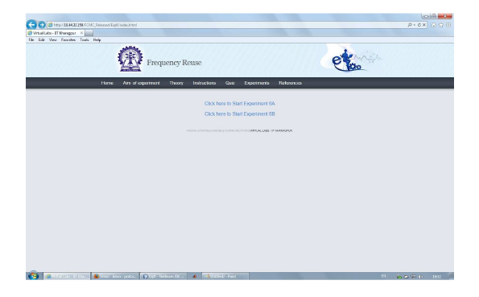
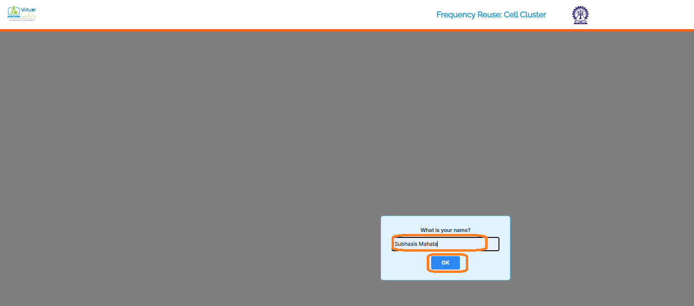
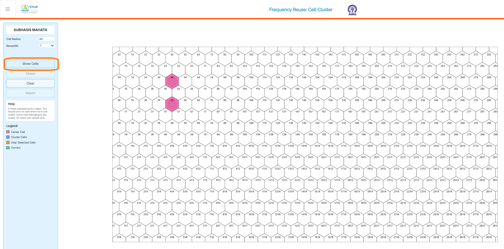
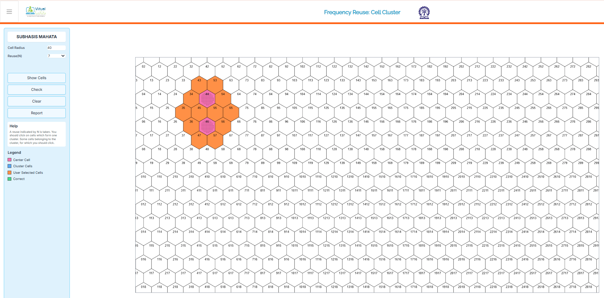
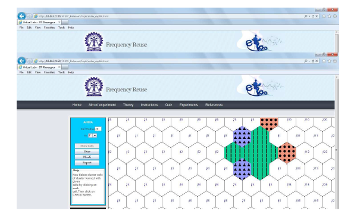
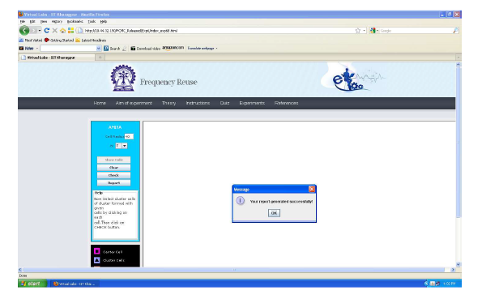

## Procedure

Follow the instructions given below to perform the experiments:-

## 1.1 Starting the Experiments :-

* Step 1: By clicking on 'Click here to start' for Experiment 6B (Cell cluster) you have to start.

   

      
      

## 1.2 Performing Experiment 6B :-

* Step 2: A page appears with a dialogue box asking for your name. Enter your name and click OK.

   

      
      

* Step 3: Choose the value of Cell Radius and Cell Cluster.

* Step 4: Click on the button Show Cells. The generated cells are shown on the RHS of the page.

   

      
      

* Step 5: Within the generated cells the two extreme cells within the cell cluster is shown in pink colour. Select other cells within the cell cluster in orange colour.

   

      
      

* Step 6: Click on the button CHECK to see whether your manually selected cluster cells match with the correct cells of the cluster. If your manually selected cells do not match with the correct cells of the cluster then the correct cells of the cluster are displayed in sky blue colour. If the manually selected cells of the cluster match with the correct cells of the cluster then the correct cells of the cluster are over-marked in green colour.

   

      
      

* Step 7: Click on the button REPORT to generate the report of the experiment you have performed.

   

      
      

* Step 8: A dialogue box appears. Click on the button Save to save your report.

* Step 9: A dialogue box appears with the message that 'Your report has generated successfully'. Click on button OK in the dialogue box.

    

      
      

* Step 10: Now you can view the pdf report.

* Step 11: You can repeat the experiment by clicking the CLEAR button at the upper corner in LHS of the page.

    
