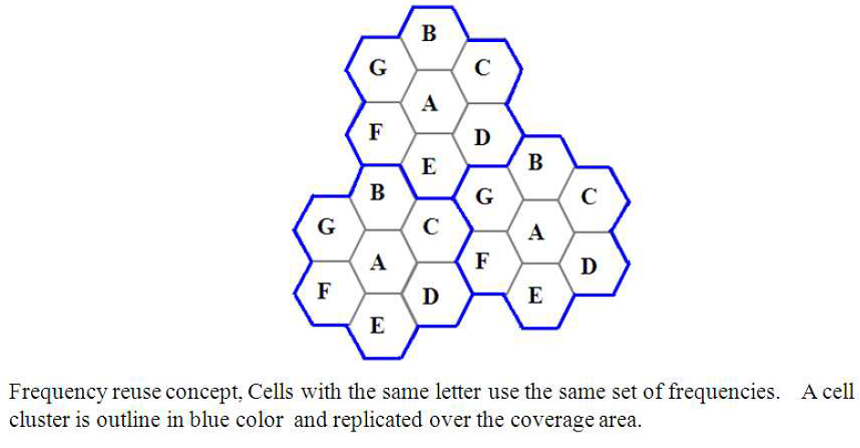

## Theory
**Introduction:**  
In mobile communication systems a slot of a carrier frequency / code in a carrier frequency is a radio resource unit. This radio resource unit is assigned to a user in order to support a call/ session. The number of available such radio resources at a base station thus determines the number of users who can be supported in the call. Since in wireless channels a signal is "broadcast" i.e. received by all entities therefore one a resource is allocated to a user it cannot be reassigned until the user finished the call/ session. Thus the number of users who can be supported in a wireless system is highly limited.

In order to support a large no. of users within a limited spectrum in a region the concept of frequency re-use is used.

The signal radiated from the transmitter antenna gets attenuated with increasing distance. At a certain distance the signal strength falls below noise threshold and is no longer identifiable.

In this region when the signal attenuates below noise floor the same radio resource may be used by another transmission to send different information. In term of cellular systems, the same radio resource (frequency) can use by two base stations which a sufficient spaced apart. In this way the same frequency gets reused in a layer- geographic area by two or more different base station different users simultaneously.

Now what is important is to select the set of base stations which will use the same set of radio resources/ channel of frequencies or technically the co- channel cells.

In this context the minimum adjacent set cells which use different frequencies each is calls a cluster.

The cellular concept is the major solution of the problem of spectral congestion and user capacity. Cellular radio relies on an intelligent allocation and channel reuse throughout a large geographical coverage region.

## 1.1 Cellular Frequency Reuse:

Each cellular base station is allocated a group of radio channels to be used within a small geographic area called a cell. Base stations in adjacent cells are assigned channel groups which contain completely different channels than neighboring cells. Base station antennas are designed to achieve the desired coverage within a particular cell. By limiting the coverage area within the boundaries of a cell, the same group of channels may be used to cover different cells that are separated from one another by geographic distances large enough to keep interference levels within tolerable limits. The design process of selecting and allocating channel groups for all cellular base stations within a system is called frequency reuse or frequency planning.

## 1.2 Hexagonal Cell Structure:

In figure 1, cells labeled with the same letter use the same group of channels. The hexagonal cell shape is conceptual and is the simplistic model of the radio coverage for each base station. It has been universally adopted since the hexagon permits easy and manageable analysis of a cellular system. The actual radio coverage of a system is known as the footprint and is determined from old measurements and propagation prediction models. Although the real footprint is amorphous in nature, a regular cell shape is needed for systematic system design and adaptation for future growth.

If a circle is chosen to represent the coverage area of a base station, adjacent circles overlaid upon a map leave gaps or overlapping regions. A square, an equilateral triangle and a hexagon can cover the entire area without overlap and with equal area. A cell must serve the weakest mobiles typically located at the edge of the cell within the foot print. For a given distance between the center of a polygon and its farthest perimeter points, the hexagon has the largest area of the three. Thus, with hexagon, the fewest number of cell scan cover a geographic region and close approximation of a circular radiation pattern that occurs for an Omni directional base antenna and free space propagation is possible.

Base station transmitters are situated either at the center of the cell (center-excited cells) or at three of the six cell vertices (edge-excited cells). Normally, omnidirectional antennas are used in center-exited cells and sectored directional antennas are used in edge-exited cells. Practical system design considerations permit a base station to be positioned up to one-fourth the cell radius away from the ideal location.

## 1.3 Cell Cluster:

Considering a cellular system that has a total of S duplex radio channels. If each cell is allocated a group of k channels and `(k < S)` if the S channels are divided among N cells into unique and disjoint channel groups of same number of channels, then,

`S=kN`

The N cells that collectively use the complete set of available frequencies are called a cluster. If a cluster is replicated M times within the system, the total number of duplex channels or capacity,

`C=MkN=MS`

      
      

**In this example,**

The cluster size N = 7 and the frequency reuse factor is 1/7 since each cell contains one-seventh of the total number of available channels.

The capacity is directly proportional to M. The factor N is called the cluster size and is typically 4, 7 or 12. If the cluster size N is reduced while the cell size is kept constant, more clusters are required to cover a given area and hence more capacity is achieved from the design viewpoint, the smallest possible value of N is desirable to maximize capacity over a given coverage area. The frequency reuse factor of a cellular system is 1/N, since each cell within a cluster is assigned 1/N of the total available channels in the system.

     
 
